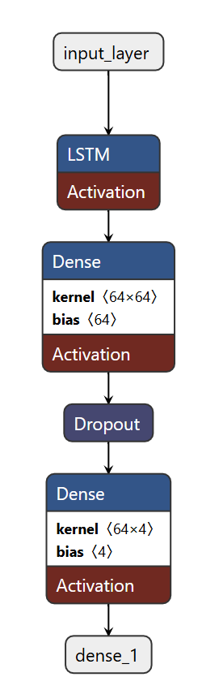
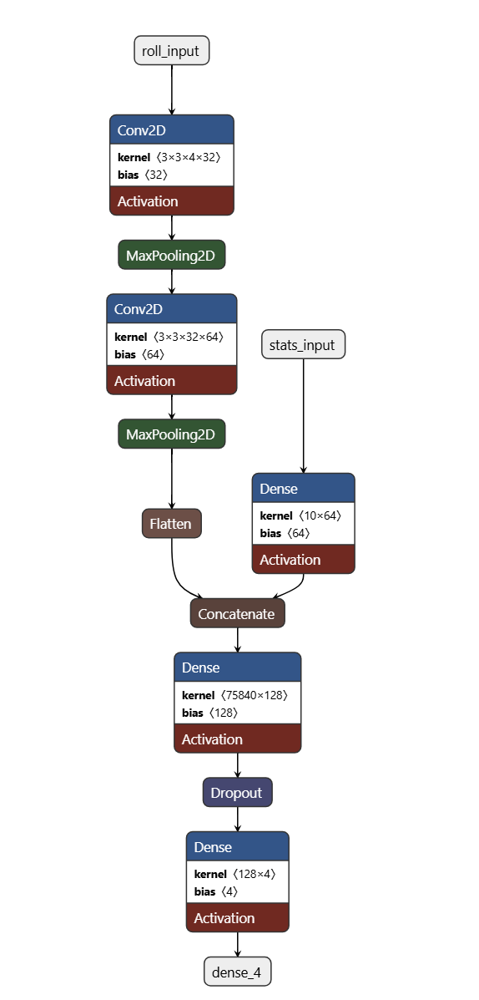

# MS-AAI-511 Music Genre and Composer Classification Using Deep Learning

[](./LICENSE)  

`Authors: Thomas Poole and Atul Prasad`

## Project Overview


The primary objective of this project is to design, develop, and evaluate a deep learning framework capable of accurately classifying classical music compositions by their respective composers. 

To achieve this objective, the project employs two complementary deep learning paradigms: Long Short-Term Memory (LSTM) networks and Convolutional Neural Networks (CNNs). LSTM networks are selected for their proficiency in modeling sequential dependencies and temporal patterns, enabling the system to capture the progression and evolution of musical notes over time. Conversely, CNNs are employed for their capacity to extract spatially localized and hierarchical feature representations from structured inputs, such as multichannel piano roll matrices and statistical descriptors of note sequences.


## Repository Structure

| File/Folder Name                                        | Description                                                                                           |
|---------------------------------------------------------|-------------------------------------------------------------------------------------------------------|
| `MS_AII_551_Team7.ipynb`                                | Google colab Notebook for the project.                        |
| `requirements.txt`                                      | Project ependencies and libraries needed to run the project.                                  |
| `README.md`                                             | Project docimentation.                                                                                         |
| `LICENSE`                                               | The licensing information for the project.                                                            |
| `Images`                                                | Contains images for different plot and model architecture                                         |


## Methodology

### 1. Data Collection

The dataset is available on Kaggle and can be found [here](https://www.kaggle.com/datasets/blanderbuss/midi-classic-music). We have used dataset ID "blanderbuss/midi-classic-music" to download the data set at runtime for kaggle.
This make sure ge get the latest data every time. Data set contains MIDI file from many different composer but we have selected ony four composed 'Bach', 'Beethoven', 'Chopin', 'Mozart'. MIDI file for each composer are in directory which is named after them. We also observed that there are nested zip files. So during data preparation phase folders are iterated recursavely to find any nested zip file and extract the files under it.

### 2. Data Pre-processing

This project uses **MIDI** files of classical compositions by multiple composers as the source dataset. Since LSTM and CNN architectures require different input formats, the preprocessing pipeline was designed separately for each model.  

---

### **1. Data Preprocessing for LSTM**  
The LSTM model focuses on capturing **temporal dependencies** in the musical sequence.  

1. **MIDI Parsing**  
   - MIDI files are parsed using the `pretty_midi` library to extract sequential note information (pitch, velocity, duration, and timing).  

2. **Sequence Representation**  
   - Each composition is transformed into a time-ordered sequence of note events.  
   - Notes are encoded into **integer tokens** or **one-hot vectors** representing pitches.  
   - Additional features such as velocity and duration are included when needed.  

3. **Sequence Padding and Truncation**  
   - To ensure uniform sequence length across samples, sequences longer than a defined maximum length are truncated, and shorter sequences are **zero-padded**.  

4. **Normalization**  
   - Pitch values are scaled to a fixed range (e.g., 0–1) to improve model convergence.  
   - Velocity and duration values are normalized separately.  

5. **Label Encoding**  
   - Composer names are converted into integer class labels using `LabelEncoder`.  

---

### **2. Data Preprocessing for CNN**  
The CNN model works on **multichannel piano roll representations** combined with statistical features for each composition.  

1. **MIDI to Piano Roll Conversion**  
   - Each MIDI file is converted into a **piano roll matrix** of shape `(128, T)`, where rows represent pitches (MIDI notes 0–127) and columns represent time steps.  
   - Four channels are generated for each time step:  
     1. **Binary Activation** – whether a note is played.  
     2. **Velocity Normalized** – scaled note intensities (0–1).  
     3. **Instrument Count** – normalized count of active instruments per pitch-time.  
     4. **Expressive Roll** – note sustain and articulation patterns.  

2. **Fixed Length & Padding**  
   - All piano rolls are padded or clipped to a fixed length (`max_length` = 150 time steps).  

3. **Statistical Feature Extraction**  
   - Global features such as **pitch min/max/mean**, **velocity mean/std**, and **tempo statistics** are extracted using `pretty_midi`.  
   - These features serve as an **auxiliary input** to the CNN’s MLP branch.  

4. **Dataset Structuring**  
   - The dataset is split **stratified by composer** into **training**, **validation**, and **test** sets using `StratifiedShuffleSplit`.  
   - Inputs are stored as:  
     - `X_roll` → multichannel piano roll array.  
     - `X_stats` → statistical feature array.  
     - `y` → one-hot encoded composer labels.  


With this preprocessing pipeline:  
- **LSTM** captures **note sequences over time**.  
- **CNN** learns **spatial-temporal patterns** and **composer-specific style statistics**.  


### 3. Feature Extraction

The project extracts **distinct sets of features** for the LSTM and CNN models to leverage their strengths in modeling sequential and spatial-temporal data.  

---

### **1. Feature Extraction for LSTM**  
The LSTM model processes **temporal sequences** derived from MIDI files.  

1. **Sequential Note Events**  
   - Extract pitch, velocity, and duration for every note in temporal order.  
   - Represent sequences as integer-encoded tokens or one-hot vectors.  

2. **Timing Features**  
   - Include note start times and durations to capture rhythmic structure.  
   - Encode time intervals between successive notes to preserve tempo variations.  

3. **Normalized Inputs**  
   - Pitch values normalized (e.g., divided by 128).  
   - Velocity values scaled to range 0–1.  
   - Duration standardized to a common scale.  

4. **One-Hot Encoded Labels**  
   - Composer labels converted to one-hot vectors for classification.  

These features allow the LSTM to learn **long-term dependencies** in note sequences and capture stylistic nuances of each composer.  

---

### **2. Feature Extraction for CNN**  
The CNN model combines **piano roll-based features** and **global statistical features**.  

#### a) Multichannel Piano Roll Features  
- **Binary Roll** – indicates if a note is played at each time step.  
- **Velocity Roll** – normalized note intensities for dynamics analysis.  
- **Instrument Count Roll** – normalized count of active instruments per pitch-time.  
- **Expressive Roll** – represents sustained notes and articulation patterns.  

Each piano roll is structured as a **4-channel image** of shape `(128, max_length, 4)`, where:  
- **Height (128)** = MIDI pitches (0–127)  
- **Width (max_length)** = fixed time steps (e.g., 150)  
- **Channels (4)** = feature types  

#### b) Statistical Features  
Extracted using the `pretty_midi` library:  
- **Pitch-based**: standard deviation, min, max.  
- **Velocity-based**: mean, standard deviation, min, max.  
- **Tempo-based**: mean, min, max.  


### 4. **Data Splitting & Class Balancing**

To ensure robust model evaluation and minimize overfitting, the dataset is divided into **training**, **validation**, and **test** subsets. A stratified sampling approach is used so that the proportion of each composer’s works is preserved across all splits.


### **1. Stratified Data Splitting**
The dataset is split into:
- **Training Set** – the primary dataset used for learning.
- **Validation Set** – used to fine-tune hyperparameters and determine optimal stopping points.
- **Test Set** – held out for the final evaluation of model performance.

Using a stratified strategy ensures that the distribution of composers remains consistent across all three sets, preventing scenarios where certain composers are overrepresented or absent in any split.


### **2. Class Balancing**
Composer datasets are often imbalanced, with some composers having far more works than others.  
To address this, **class weights** are calculated and applied during training. This technique ensures that the model assigns equal importance to all composers, regardless of how frequently their works appear in the dataset.

By weighting underrepresented classes more heavily, the model avoids bias toward dominant composers and improves its ability to generalize across all categories.

- Stratified splitting ensures fair representation of each composer across all dataset partitions.
- Class balancing addresses data imbalance by giving equal influence to all classes.
- Together, these strategies create a more reliable and unbiased training process.


### 5. Model Building

This project employs two distinct deep learning architectures to classify musical compositions by composer:  
1. **Long Short-Term Memory (LSTM) Network**  
2. **Hybrid Convolutional Neural Network (CNN) + Multi-Layer Perceptron (MLP)**

---

### **1. LSTM Model**
The LSTM model is designed to capture **temporal dependencies** and **sequential patterns** in music data.  
- **Input**: Sequential note features derived from MIDI files, such as pitch and velocity over time.  
- **Architecture**:  
  - LSTM layers to process time-series features.
  - Fully connected dense layers for classification.
  - Dropout layers to prevent overfitting.
- **Output**: Softmax layer producing probabilities for each composer class.



---

### **2. Hybrid CNN + MLP Model**
The CNN-based approach focuses on **spatial and multi-channel relationships** in piano roll data, combined with **statistical note features** through a secondary branch.  
- **CNN Branch**:
  - Processes multi-channel piano roll representations (binary activation, normalized velocity, instrument activity, and expressive note spans).
  - Extracts local musical patterns and harmonic textures.
- **MLP Branch**:
  - Processes aggregated MIDI statistics such as pitch range, velocity variation, and tempo features.
- **Fusion Layer**:
  - Merges CNN and MLP outputs to combine temporal-spatial and statistical information.
  - Fully connected layers for final classification.
- **Output**: Softmax layer for multi-class composer prediction.




---

### **Design Considerations**
- **Regularization**: Dropout layers are applied to reduce overfitting.
- **Optimization**: Adam optimizer is used for efficient convergence.
- **Loss Function**: Categorical cross-entropy is applied for multi-class classification.
- **Evaluation Metric**: Accuracy is used as the primary metric, supplemented by class-wise precision, recall, and F1-score during evaluation.


### 6. Model Training

The training phase was conducted separately for both the **LSTM** and **Hybrid CNN + MLP** models, with careful attention to optimization, regularization, and generalization.


### **1. LSTM Model Training**
- **Data Input**: Sequential note representations were fed into the model in batch form.
- **Loss Function**: Categorical cross-entropy for multi-class classification.
- **Optimizer**: Adam optimizer, chosen for its adaptive learning rate capabilities.
- **Regularization**:
  - Dropout layers applied to reduce overfitting.
  - Early stopping to halt training when validation performance stopped improving.
- **Learning Rate Scheduling**: The learning rate was reduced automatically if the validation loss plateaued, aiding in fine-tuning the model during later epochs.
- **Class Balancing**: Class weights were calculated and applied to address class imbalances in the dataset.


### **2. Hybrid CNN + MLP Model Training**
- **Data Input**:
  - Multi-channel piano roll tensors for the CNN branch.
  - Aggregated statistical note features for the MLP branch.
- **Loss Function**: Categorical cross-entropy for consistent multi-class handling.
- **Optimizer**: Adam optimizer with learning rate scheduling for adaptive convergence.
- **Regularization**:
  - Dropout applied in fully connected layers to mitigate overfitting.
  - Early stopping to preserve the best-performing weights.
- **Class Balancing**: Class weights applied to ensure balanced learning across all composer categories.
- **Callbacks**:
  - Early stopping to prevent unnecessary epochs once validation performance stabilized.
  - Learning rate reduction on plateau to encourage better convergence in later stages.


### **Training Strategy**
- Models were trained using mini-batches to optimize GPU utilization.
- Validation data was used to tune hyperparameters and track overfitting tendencies.
- Each architecture was saved both before and after training:
  - **Raw Model**: Saved after architecture definition but before training.
  - **Trained Model**: Saved after completion of the training process with the best weights restored from early stopping.

By using a combination of early stopping, learning rate scheduling, and class balancing, both models achieved strong generalization performance while minimizing overfitting, ensuring robustness on unseen test data.

### 7. Model Evaluation

The trained models were evaluated using multiple metrics and visualization techniques to comprehensively assess classification performance for composer prediction. Both the **LSTM** and **Hybrid CNN + MLP** architectures underwent the same evaluation pipeline.


### **1. Evaluation Metrics**
- **Accuracy**: Measured overall correct predictions on the test set.
- **Precision, Recall, and F1-Score**:
  - Precision evaluates how many predicted samples of a class were correct.
  - Recall measures how well the model retrieved all relevant samples for a class.
  - F1-score provides a balance between precision and recall.
- **Macro & Weighted Averages**: Macro average gives equal weight to all classes, while weighted average accounts for class imbalance.
- **Top-K Accuracy**:
  - **Top-1 Accuracy**: Measures the correctness of the top prediction.
  - **Top-2 & Top-3 Accuracy**: Evaluates if the correct label appears in the top K predictions, useful for close classifications.


### **2. Visualizations**
- **Confusion Matrix**:
  - Displays the distribution of true vs. predicted labels.
  - Both normalized and raw count matrices were used to reveal patterns of misclassification.
- **ROC Curves**:
  - Multi-class ROC plots were generated to visualize the trade-off between true positive rate (TPR) and false positive rate (FPR) for each composer.
  - Area Under the Curve (AUC) values were calculated to quantify classification separability.
- **Precision-Recall Curves**:
  - Illustrated model performance under varying probability thresholds, highlighting performance in imbalanced data scenarios.
- **Training History**:
  - Plots of training vs. validation accuracy over epochs.
  - Plots of training vs. validation loss to monitor convergence and detect overfitting trends.
- **Learning Rate over Epochs**:
  - Visualized learning rate adjustments during training, confirming effective scheduling behavior.


### **3. Performance Summary**
- The evaluation revealed strong generalization for the majority class (e.g., Bach) and moderate performance for underrepresented composers (e.g., Chopin, Beethoven, Mozart).
- Class balancing during training improved recall for minority classes but did not fully eliminate misclassification between stylistically similar composers.
- Top-3 accuracy scores were significantly higher than Top-1, indicating that in most cases, the correct composer was within the top predictions even when the top choice was incorrect.


### **4. Insights**
- Misclassifications often occurred between composers with overlapping stylistic traits.
- ROC curves demonstrated that certain classes had a clearer decision boundary than others.
- Precision-recall analysis indicated that threshold tuning could further improve results for minority classes.
- The combination of sequential (LSTM) and hybrid spatial-statistical (CNN + MLP) approaches offered complementary strengths.

The evaluation metrics and visualizations confirm that the models are capable of capturing composer-specific musical patterns, with the hybrid CNN + MLP showing slightly better robustness for complex feature combinations, while the LSTM excelled in sequential pattern recognition.

### 8. Conclusion

This project successfully demonstrated the application of deep learning methods—**Long Short-Term Memory (LSTM)** and a **Hybrid Convolutional Neural Network (CNN) + Multilayer Perceptron (MLP)**—to the task of classical composer classification from MIDI data. The dual-architecture approach allowed for a comprehensive evaluation of both **temporal** and **spatial-statistical** feature representations in musical compositions.


### **Key Findings**
- **Hybrid CNN + MLP Performance**:
  - Achieved a **Top-1 accuracy of 81.08%** on the test set.
  - Demonstrated high **Top-2 accuracy (94.59%)** and **Top-3 accuracy (98.50%)**, indicating that the correct composer was often among the top predictions even in cases of misclassification.
  - Excelled in identifying compositions by **Bach** with a precision of **91.93%** and recall of **96.70%**, while showing moderate results for composers with fewer samples such as **Chopin** and **Beethoven**.
- **Model Robustness**:
  - Class balancing strategies reduced bias toward the majority class, improving recall for minority classes, though stylistic overlaps still led to certain confusions.
  - The CNN model benefited from **multichannel piano roll representations** combined with **statistical note features**, allowing it to capture both local patterns (via convolution) and global structural traits (via dense layers).
- **Comparative LSTM Insights**:
  - The LSTM architecture was more effective at learning long-term dependencies in sequential data, performing well on temporal aspects of music but with slightly lower overall classification accuracy compared to CNN.

---

### **Visual Insights**
- **Confusion Matrix** plots revealed strong diagonal dominance for Bach but noticeable overlaps between Mozart, Chopin, and Beethoven.
- **ROC curves** showed high AUC scores for Bach, with lower separation margins for stylistically similar composers.
- **Learning rate** and **training history plots** confirmed effective convergence without severe overfitting.
- **Precision-Recall curves** reinforced that threshold tuning could improve minority-class recall without significantly impacting majority-class performance.


- The results validate the feasibility of **automated composer classification** using deep learning and highlight the benefits of combining different feature modalities (temporal sequences and multichannel spatial representations).
- The **Hybrid CNN + MLP** approach proved more versatile and accurate for this dataset, while the LSTM provided valuable insights into purely sequential modeling of music.
- The framework developed here is adaptable to other symbolic music classification tasks, opening possibilities for **style recognition**, **plagiarism detection**, and **musicological analysis**.
- Future improvements could include **data augmentation for underrepresented composers**, **attention mechanisms for both CNN and LSTM**, and **threshold-optimized prediction** to further improve recall across all classes.


### Steps to run the code
Ths project can be run on either local python environment using Jupytor Notebook or GoogleCollab

Pre requisites

- 300 MB of disk space. Since we are downloading the data and storing it on the disk.
- For better performance 32 GB RAM on local or if running on googleCollab then Python 3 environment with CPU or higher Hardware acceleration.

** Running the code on local machine **
1. Clone the project:
   ```bash
   git clone https://github.com/realtommypoole/AAI-511-Team-7-Compo-Identi.git
   ```
2. Navigate to cloned project:
   ```bash
   cd AAI-511-Team-7-Compo-Identi
   ```
3. Install the dependencies:
   ```bash
   pip install -r requirements.txt
   ```
4. open the notebook and verify IS_GOOGLE_COLAB = False, if not false then set it to false and save the file
5. Run the Jupyter Notebook:
   ```bash
   jupyter notebook "MS_AII_551_Team7.ipynb"
   ```

** Running the code on Google colab **
1. Navigate to https://github.com/realtommypoole/AAI-511-Team-7-Compo-Identi/tree/main on any browser
2. click on file MS_AII_551_Team7.ipynb
3. click on "Open in colab"
4. Make sure IS_GOOGLE_COLAB = True in the file if not make it true
5. click on run all


## License

This project is licensed under the MIT License. See the `LICENSE` file for more details.
